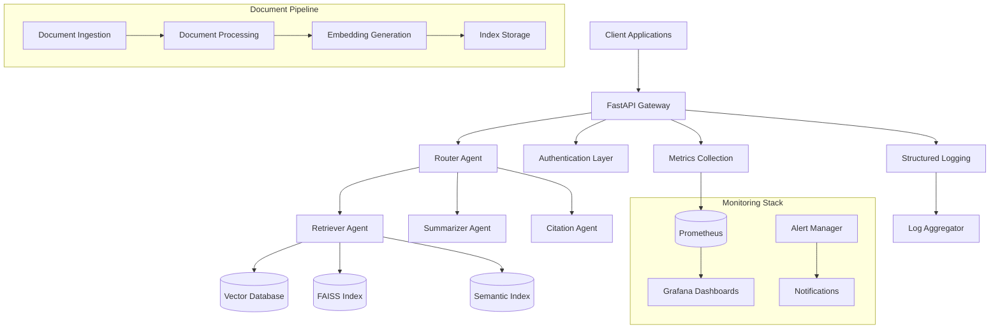
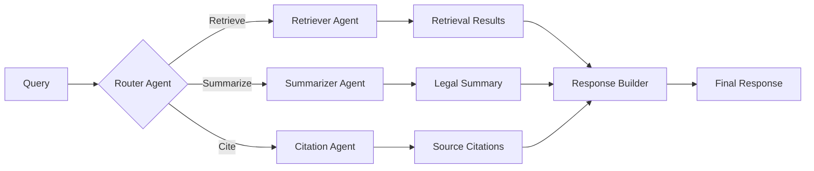

# LexGraph Legal RAG - System Architecture

## Overview

LexGraph Legal RAG is a multi-agent system built on LangGraph that provides intelligent retrieval, reasoning, and citation of legal clauses from large document stores. The system employs a recursive graph architecture with specialized agents that collaborate to deliver precise, citation-rich legal analysis.

## System Design

### High-Level Architecture

### Data Flow

1. **Document Ingestion**: Legal documents are processed through the ingestion pipeline
2. **Index Creation**: Documents are converted to embeddings and stored in FAISS/vector indices
3. **Query Processing**: User queries are routed through the multi-agent system
4. **Retrieval**: Relevant document chunks are retrieved using semantic search
5. **Reasoning**: Agents collaborate to analyze and synthesize information
6. **Citation**: Response includes precise clause-level citations and references

### Component Architecture

#### Core Components

- **API Gateway**: FastAPI-based REST API with authentication and rate limiting
- **Multi-Agent System**: LangGraph-powered agent orchestration
- **Document Pipeline**: Parallel processing for large document corpora
- **Vector Storage**: FAISS indices with semantic search capabilities
- **Monitoring**: Prometheus metrics with Grafana visualization

#### Agent Architecture

### Technology Stack

- **Backend**: Python 3.8+, FastAPI, LangGraph
- **Vector Search**: FAISS, scikit-learn embeddings
- **Monitoring**: Prometheus, Grafana, structlog
- **Containerization**: Docker, Kubernetes
- **Testing**: pytest, coverage reporting
- **Security**: API key authentication, secrets scanning

### Scalability Considerations

- **Horizontal Scaling**: Stateless API design enables horizontal pod autoscaling
- **Index Sharding**: Large document corpora can be sharded across multiple FAISS indices
- **Caching**: Semantic search results cached for performance optimization
- **Async Processing**: Document ingestion runs asynchronously for large batches

### Security Architecture

- **API Authentication**: X-API-Key header validation
- **Secrets Management**: Environment variable configuration
- **Network Security**: Kubernetes network policies
- **Data Protection**: No PII logging, secure document handling

## Deployment Architecture

### Development Environment
- Local development with Docker Compose
- Pre-commit hooks for code quality
- pytest test suite with coverage reporting

### Production Environment
- Kubernetes deployment with HPA
- Prometheus monitoring with alerting
- Grafana dashboards for observability
- Structured logging with correlation IDs

## Quality Attributes

- **Performance**: Sub-second query response times
- **Scalability**: Handles 10K+ documents, 100+ concurrent users
- **Reliability**: 99.9% uptime with circuit breaker patterns
- **Security**: Authentication, authorization, and audit logging
- **Maintainability**: Comprehensive testing and documentation
- **Observability**: Metrics, logging, and distributed tracing

## Future Considerations

- Integration with external legal databases (Westlaw, LexisNexis)
- Multi-jurisdiction legal framework support
- Advanced citation graph analysis
- Real-time document update capabilities
- Legal precedent tracking and analysis