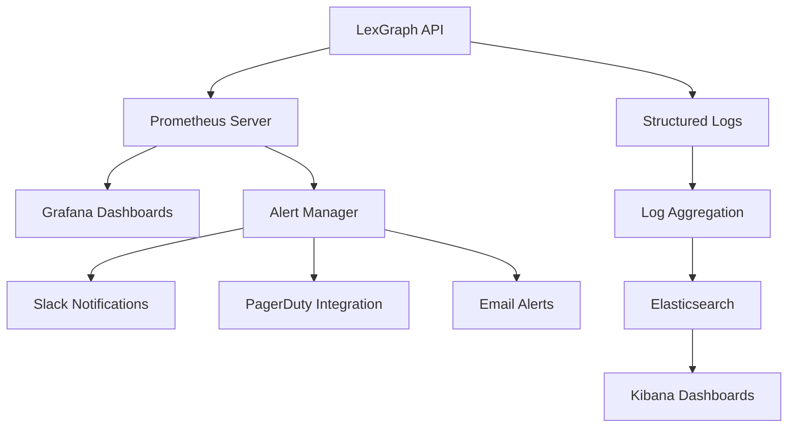

# Monitoring and Observability Guide

This document provides comprehensive guidance on monitoring, observability, and operational procedures for the LexGraph Legal RAG system. Our monitoring strategy emphasizes proactive issue detection, performance optimization, and business metrics tracking.

## Monitoring Philosophy

### Three Pillars of Observability

1. **Metrics**: Quantitative data about system performance and behavior
2. **Logs**: Event records for debugging and audit trails
3. **Traces**: Request flow tracking across system components

### Monitoring Objectives

- **Early Detection**: Identify issues before they impact users
- **Performance Optimization**: Track and improve system performance
- **Capacity Planning**: Understand usage patterns and resource needs
- **Business Intelligence**: Monitor business-critical metrics and KPIs
- **Compliance**: Maintain audit trails and regulatory compliance

## Monitoring Stack

### Core Components

- **Prometheus**: Metrics collection and alerting
- **Grafana**: Visualization and dashboards
- **Alertmanager**: Alert routing and notifications
- **Structured Logging**: JSON-formatted logs with correlation IDs
- **Health Checks**: Application and dependency health monitoring

### Architecture Overview



## Metrics Collection

### Application Metrics

#### HTTP Request Metrics
```python
# Prometheus metrics in metrics.py
http_requests_total = Counter(
    'http_requests_total',
    'Total HTTP requests',
    ['method', 'endpoint', 'status']
)

http_request_duration_seconds = Histogram(
    'http_request_duration_seconds',
    'HTTP request duration',
    ['method', 'endpoint']
)
```

#### Business Metrics
```python
# Search operation metrics
search_operations_total = Counter(
    'search_operations_total',
    'Total search operations',
    ['query_type', 'result_count']
)

search_accuracy_score = Histogram(
    'search_accuracy_score',
    'Search result accuracy scores',
    buckets=[0.1, 0.2, 0.3, 0.4, 0.5, 0.6, 0.7, 0.8, 0.9, 1.0]
)

vector_index_size = Gauge(
    'vector_index_size_bytes',
    'Size of vector index in bytes'
)
```

#### System Resource Metrics
```python
# Memory usage
memory_usage_bytes = Gauge(
    'memory_usage_bytes',
    'Current memory usage in bytes'
)

# CPU utilization
cpu_usage_percent = Gauge(
    'cpu_usage_percent',
    'Current CPU usage percentage'
)
```

### Prometheus Configuration

#### Scrape Configuration
```yaml
# monitoring/prometheus.yml
global:
  scrape_interval: 15s
  evaluation_interval: 15s

scrape_configs:
  - job_name: 'lexgraph-api'
    static_configs:
      - targets: ['lexgraph-api:8001']
    scrape_interval: 5s
    metrics_path: /metrics
    scrape_timeout: 10s
    
  - job_name: 'redis'
    static_configs:
      - targets: ['redis:6379']
    scrape_interval: 10s
```

#### Recording Rules
```yaml
# Precomputed metrics for dashboard performance
groups:
  - name: lexgraph_recording_rules
    interval: 30s
    rules:
      - record: lexgraph:request_rate_5m
        expr: rate(http_requests_total[5m])
        
      - record: lexgraph:error_rate_5m
        expr: rate(http_requests_errors_total[5m]) / rate(http_requests_total[5m])
        
      - record: lexgraph:latency_p95_5m
        expr: histogram_quantile(0.95, rate(http_request_duration_seconds_bucket[5m]))
```

## Alerting System

### Alert Rules

#### Critical Alerts
```yaml
# monitoring/lexgraph_alerts.yml
groups:
- name: lexgraph_critical
  rules:
  - alert: ServiceDown
    expr: up{job="lexgraph-api"} == 0
    for: 1m
    labels:
      severity: critical
      team: platform
    annotations:
      summary: "LexGraph API is down"
      description: "Service has been down for more than 1 minute"
      runbook_url: "https://docs.company.com/runbooks/service-down"
      
  - alert: HighErrorRate
    expr: lexgraph:error_rate_5m > 0.05
    for: 5m
    labels:
      severity: critical
      team: platform
    annotations:
      summary: "High error rate detected"
      description: "Error rate is {{ $value | humanizePercentage }} over the last 5 minutes"
```

#### Warning Alerts
```yaml
- alert: HighLatency
  expr: lexgraph:latency_p95_5m > 2.0
  for: 10m
  labels:
    severity: warning
    team: platform
  annotations:
    summary: "High latency detected"
    description: "95th percentile latency is {{ $value }}s"
    
- alert: HighMemoryUsage
  expr: memory_usage_bytes / (1024*1024*1024) > 1.5
  for: 5m
  labels:
    severity: warning
  annotations:
    summary: "High memory usage"
    description: "Memory usage is {{ $value }}GB"
```

### Alert Manager Configuration

```yaml
# alertmanager.yml
global:
  smtp_smarthost: 'localhost:587'
  smtp_from: 'alerts@company.com'

route:
  group_by: ['alertname']
  group_wait: 10s
  group_interval: 10s
  repeat_interval: 1h
  receiver: 'default'
  routes:
  - match:
      severity: critical
    receiver: 'critical-alerts'
  - match:
      severity: warning
    receiver: 'warning-alerts'

receivers:
- name: 'default'
  email_configs:
  - to: 'team@company.com'
    subject: '[ALERT] {{ .GroupLabels.alertname }}'
    
- name: 'critical-alerts'
  slack_configs:
  - api_url: 'YOUR_SLACK_WEBHOOK_URL'
    channel: '#alerts-critical'
    title: 'Critical Alert: {{ .GroupLabels.alertname }}'
  pagerduty_configs:
  - routing_key: 'YOUR_PAGERDUTY_KEY'
    description: '{{ .GroupLabels.alertname }}'
```

## Grafana Dashboards

### Application Performance Dashboard

#### Key Metrics Panels
- Request Rate (requests/second)
- Error Rate (percentage)
- Response Time Percentiles (50th, 95th, 99th)
- Active Requests
- Memory Usage
- CPU Utilization

#### Sample Dashboard Configuration
```json
{
  "dashboard": {
    "title": "LexGraph Legal RAG - Application Performance",
    "panels": [
      {
        "title": "Request Rate",
        "type": "graph",
        "targets": [
          {
            "expr": "rate(http_requests_total[5m])",
            "legendFormat": "{{method}} {{endpoint}}"
          }
        ]
      },
      {
        "title": "Error Rate",
        "type": "singlestat",
        "targets": [
          {
            "expr": "rate(http_requests_errors_total[5m]) / rate(http_requests_total[5m])",
            "legendFormat": "Error Rate"
          }
        ]
      }
    ]
  }
}
```

### Business Metrics Dashboard

#### Legal-Specific Metrics
- Search Query Volume
- Average Search Accuracy Scores
- Citation Generation Success Rate
- Document Index Health
- User Session Metrics

### Infrastructure Dashboard

#### System Health Metrics
- Container Resource Usage
- Database Performance
- Network I/O
- Disk Utilization
- Load Balancer Metrics

## Structured Logging

### Log Configuration

```python
# logging_config.py
import structlog
import logging

def configure_logging():
    structlog.configure(
        processors=[
            structlog.stdlib.filter_by_level,
            structlog.stdlib.add_logger_name,
            structlog.stdlib.add_log_level,
            structlog.stdlib.PositionalArgumentsFormatter(),
            structlog.processors.TimeStamper(fmt="iso"),
            structlog.processors.StackInfoRenderer(),
            structlog.processors.format_exc_info,
            structlog.processors.UnicodeDecoder(),
            structlog.processors.JSONRenderer()
        ],
        context_class=dict,
        logger_factory=structlog.stdlib.LoggerFactory(),
        wrapper_class=structlog.stdlib.BoundLogger,
        cache_logger_on_first_use=True,
    )
```

### Correlation ID Tracking

```python
# correlation.py
import uuid
from contextvars import ContextVar

correlation_id_var: ContextVar[str] = ContextVar('correlation_id', default='')

def get_correlation_id() -> str:
    return correlation_id_var.get() or str(uuid.uuid4())

def set_correlation_id(correlation_id: str) -> None:
    correlation_id_var.set(correlation_id)

# Middleware for FastAPI
@app.middleware("http")
async def correlation_id_middleware(request: Request, call_next):
    correlation_id = request.headers.get("X-Correlation-ID", str(uuid.uuid4()))
    set_correlation_id(correlation_id)
    response = await call_next(request)
    response.headers["X-Correlation-ID"] = correlation_id
    return response
```

### Log Message Standards

```python
# Example structured log messages
logger.info(
    "search_operation_completed",
    query=user_query,
    results_count=len(results),
    accuracy_score=0.85,
    duration_ms=response_time,
    correlation_id=get_correlation_id()
)

logger.error(
    "vector_index_load_failed",
    index_path=index_path,
    error_type=type(e).__name__,
    error_message=str(e),
    correlation_id=get_correlation_id()
)
```

## Health Checks

### Application Health Endpoint

```python
# health_check.py
from fastapi import FastAPI, status
from pydantic import BaseModel
from typing import Dict, Any

class HealthResponse(BaseModel):
    status: str
    timestamp: str
    version: str
    dependencies: Dict[str, Any]

@app.get("/health", response_model=HealthResponse)
async def health_check():
    """Comprehensive health check endpoint."""
    dependencies = {
        "vector_index": check_vector_index_health(),
        "openai_api": check_openai_connectivity(),
        "redis": check_redis_connectivity(),
        "memory_usage": get_memory_usage(),
        "disk_space": get_disk_usage()
    }
    
    overall_status = "healthy" if all(
        dep.get("status") == "healthy" for dep in dependencies.values()
    ) else "unhealthy"
    
    return HealthResponse(
        status=overall_status,
        timestamp=datetime.utcnow().isoformat(),
        version=get_application_version(),
        dependencies=dependencies
    )
```

### Dependency Health Checks

```python
def check_vector_index_health() -> Dict[str, Any]:
    """Check FAISS vector index availability."""
    try:
        index_size = get_index_size()
        return {
            "status": "healthy",
            "index_size": index_size,
            "last_updated": get_index_last_modified()
        }
    except Exception as e:
        return {
            "status": "unhealthy",
            "error": str(e)
        }

def check_openai_connectivity() -> Dict[str, Any]:
    """Test OpenAI API connectivity."""
    try:
        # Simple API test
        response = openai_client.models.list()
        return {
            "status": "healthy",
            "response_time_ms": response.response_time
        }
    except Exception as e:
        return {
            "status": "unhealthy",
            "error": str(e)
        }
```

## Performance Monitoring

### Key Performance Indicators (KPIs)

#### Application Performance
- **Response Time**: 95th percentile < 1 second
- **Throughput**: Handle 100+ concurrent requests
- **Error Rate**: < 1% for 5-minute periods
- **Availability**: 99.9% uptime SLA

#### Business Metrics
- **Search Accuracy**: Average accuracy score > 0.85
- **Citation Quality**: Citation generation success rate > 95%
- **User Satisfaction**: Query completion rate > 90%

### Performance Baselines

```python
# Performance thresholds
PERFORMANCE_THRESHOLDS = {
    "response_time_p95": 1.0,  # seconds
    "error_rate_5m": 0.01,     # 1%
    "memory_usage_gb": 2.0,    # GB
    "cpu_usage_percent": 80,   # %
    "search_accuracy": 0.85    # 85%
}
```

### Load Testing Integration

```javascript
// k6 performance monitoring script
import http from 'k6/http';
import { check } from 'k6';
import { Rate } from 'k6/metrics';

export let errorRate = new Rate('errors');

export let options = {
  stages: [
    { duration: '5m', target: 100 },
    { duration: '10m', target: 100 },
    { duration: '5m', target: 0 },
  ],
  thresholds: {
    'http_req_duration': ['p(95)<1000'], // 95% under 1s
    'errors': ['rate<0.01'],             // <1% errors
  },
};

export default function() {
  let response = http.post('http://localhost:8000/api/v1/search', {
    query: 'What constitutes breach of contract?'
  });
  
  let success = check(response, {
    'status is 200': (r) => r.status === 200,
    'response time < 1s': (r) => r.timings.duration < 1000,
  });
  
  errorRate.add(!success);
}
```

## Operational Procedures

### Incident Response

#### Severity Levels
- **P1 (Critical)**: Service completely down or major functionality broken
- **P2 (High)**: Significant performance degradation or partial functionality loss
- **P3 (Medium)**: Minor issues not affecting core functionality
- **P4 (Low)**: Cosmetic issues or optimization opportunities

#### Response Procedures

```bash
# Incident Response Checklist
1. Acknowledge Alert
   - Check monitoring dashboards
   - Verify issue scope and impact
   
2. Initial Assessment
   - Check service status: curl http://api/health
   - Review recent deployments and changes
   - Check resource utilization
   
3. Mitigation
   - Scale resources if needed: kubectl scale deployment/lexgraph-api --replicas=5
   - Restart services if required: kubectl rollout restart deployment/lexgraph-api
   - Apply hotfixes or rollback if necessary
   
4. Communication
   - Update status page
   - Notify stakeholders
   - Document actions taken
   
5. Post-Incident
   - Conduct root cause analysis
   - Update runbooks and procedures
   - Implement preventive measures
```

### Capacity Planning

#### Growth Projections
- **User Growth**: Plan for 50% quarterly growth
- **Data Growth**: Vector index growth of 100GB/month
- **Request Volume**: 20% monthly increase in API requests

#### Resource Scaling Guidelines

```yaml
# Resource scaling thresholds
CPU_SCALE_UP_THRESHOLD: 70%    # Scale up when CPU > 70%
CPU_SCALE_DOWN_THRESHOLD: 30%  # Scale down when CPU < 30%
MEMORY_SCALE_UP_THRESHOLD: 80% # Scale up when memory > 80%
RESPONSE_TIME_THRESHOLD: 2.0   # Scale up when p95 > 2s
```

### Maintenance Procedures

#### Regular Maintenance Tasks
- **Daily**: Review dashboards and alerts
- **Weekly**: Performance trend analysis
- **Monthly**: Capacity planning review
- **Quarterly**: SLA and performance goal review

#### Automated Maintenance

```bash
#!/bin/bash
# maintenance.sh - Automated maintenance tasks

# Clean up old log files
find /app/logs -name "*.log" -mtime +30 -delete

# Rotate Prometheus data
# (Handled by Prometheus retention settings)

# Backup vector indices
tar -czf /backups/indices-$(date +%Y%m%d).tar.gz /app/data/indices/

# Health check and report generation
curl -f http://localhost:8000/health > /tmp/health.json
python generate_health_report.py /tmp/health.json
```

## Troubleshooting Guide

### Common Issues and Solutions

#### High Response Times
```bash
# Check CPU and memory usage
kubectl top pods
kubectl describe pod lexgraph-api-xxx

# Check database performance
redis-cli info stats

# Review slow queries
grep "duration_ms" /app/logs/app.log | sort -n | tail -10
```

#### Memory Leaks
```bash
# Monitor memory usage over time
kubectl exec -it pod-name -- ps aux | grep python
kubectl exec -it pod-name -- free -h

# Generate memory profile
py-spy top --pid <python-pid>
```

#### Search Accuracy Issues
```bash
# Check vector index integrity
python -c "import faiss; index = faiss.read_index('index.faiss'); print(f'Index size: {index.ntotal}')"

# Review search quality metrics
curl http://localhost:8001/metrics | grep search_accuracy
```

## Security Monitoring

### Security Metrics

```python
# Security-related metrics
failed_authentication_attempts = Counter(
    'failed_auth_attempts_total',
    'Total failed authentication attempts',
    ['source_ip', 'user_agent']
)

rate_limit_exceeded = Counter(
    'rate_limit_exceeded_total',
    'Total rate limit violations',
    ['endpoint', 'source_ip']
)
```

### Security Alerts

```yaml
- alert: SuspiciousActivity
  expr: rate(failed_auth_attempts_total[5m]) > 10
  for: 2m
  labels:
    severity: warning
    category: security
  annotations:
    summary: "High rate of authentication failures"
    description: "{{ $value }} failed auth attempts per second"
```

This comprehensive monitoring guide ensures proactive system health management, performance optimization, and reliable operation of the LexGraph Legal RAG system.